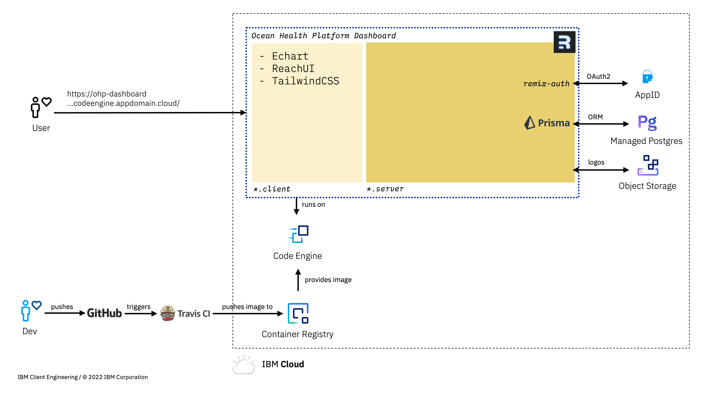

# Ocean Health Platform

This repository contains the prototype front-end and back-end components to Seabin's Ocean Health Platform dashboard. As of Sep 20th 2022, the program view is implemented. For a backlog of the features to be built, see [Trello](https://trello.com/b/BCeycHlD/seabin).


Architecturally, the dashboard is built to run anywhere that supports a CRI-O/Docker container runtime and consumes external stateful and security services. On IBM Cloud, the following services are used:

- [IBM Cloud Code Engine](https://cloud.ibm.com/codeengine/overview): serverless container runtime used for the dashboard itself
- [Database for Postgres](https://cloud.ibm.com/databases/databases-for-postgresql/create): managed Postgres database
- [Object Storage](https://cloud.ibm.com/objectstorage/create): host sponsor images
- [Container Registry](https://cloud.ibm.com/registry/catalog): store built images for Code Engine
- [App ID](https://cloud.ibm.com/catalog/services/app-id): authentication and authorisation service

For the dashboard, React and Typescript are used. The main libraries used are:

- [Remix](https://remix.run/): web framework 
- [Prisma](https://prisma.io/): ORM
- [TailwindCSS](https://tailwindcss.com/): CSS library
- [ReachUI](https://reach.tech/): base components
- [Apache ECharts](https://echarts.apache.org/): charts library



## Development

Create a `.env` file in the root folder of this repository containining the database connection URL and App ID's client secret.

```
DATABASE_URL="postgres://..."
CLIENT_SECRET="..."
```

From your terminal:

```sh
# Install dependencies
npm install

# Generate prisma schema and typescript files.
npx prisma generate 

# Start a local dev server
npm run dev
```

This starts your app in development mode, rebuilding assets on file changes.

## Deployment

This repository includes a Travis build pipeline. An IBM Cloud API key and resource group need to be configured in Travis settings. Deployment to Code Engine is manual at this point. Push to Git to start the pipeline.
